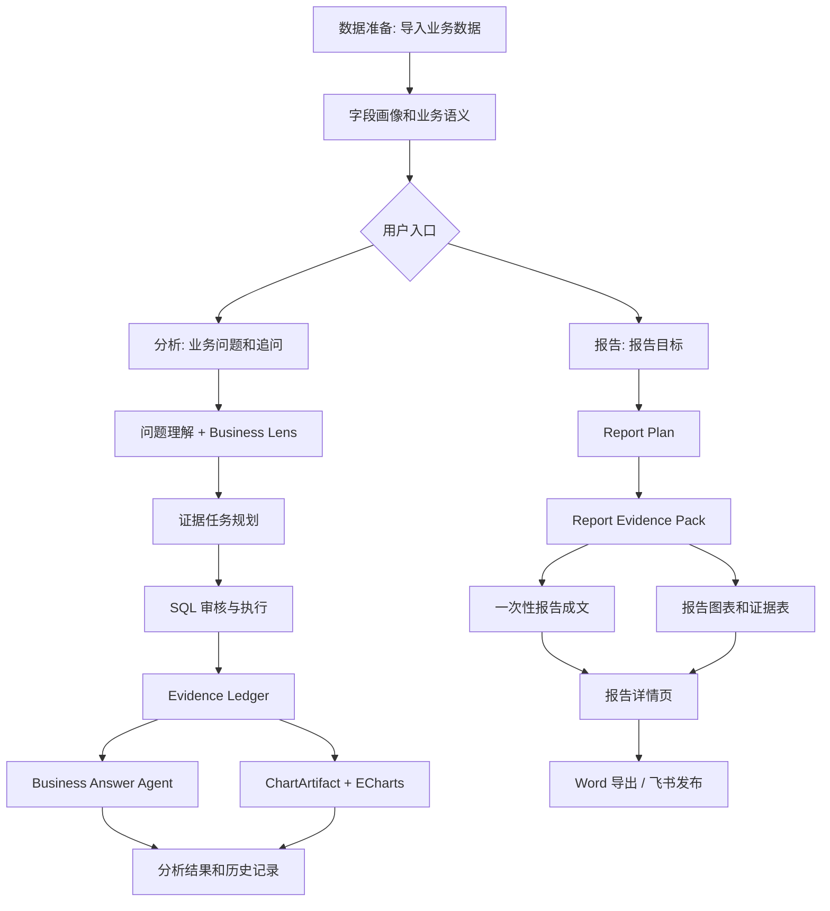

# InsightFlow Agent

InsightFlow Agent 是一个中文优先的业务数据分析智能体产品原型。用户可以导入 CSV、Excel 或 SQLite 数据，用自然语言提出业务问题，生成证据驱动的分析结论、交互图表、经营报告，并把报告导出为 Word 或发布到飞书文档。

项目重点展示三类能力：

- **Multi-agent workflow**: 问题理解、业务口径落地、证据规划、SQL 审核与执行、证据账本、业务回答、图表生成、报告成文、外部发布分工协作。
- **Tool calling**: SQLite 查询、SQL 安全审核、ECharts 图表生成、Word 文档导出、飞书文档发布。
- **Evidence-backed business output**: 大模型负责解释和表达，事实层由工具查数、计算、校验和引用证据，减少“看起来合理但没有数据支撑”的回复。

## 当前能力

- **数据源管理**: 支持上传 CSV、Excel 工作簿，或导入 SQLite 数据库。
- **数据理解**: 自动生成数据画像、字段识别、中文业务别名和语义层草稿。
- **分析工作台**: 支持中文业务提问、追问、历史分析恢复、多证据任务、证据账本、业务结论和图表展示。
- **报告中心**: 根据用户输入的报告目标生成完整中文业务报告，不复用分析工作台的问答拼接路径。
- **图表系统**: 统一 `ChartArtifact` 合同，前端使用 ECharts 交互展示，并保留静态图片 fallback。
- **真实导出**: 支持下载 Word 报告，也可以通过 `lark-cli` 发布到飞书文档，包含正文、证据表和图表图片。
- **安全边界**: SQL 审核、只读查询、证据校验、artifact hygiene、敏感信息过滤和本地生成物忽略。
- **统一产品界面**: 采用“数据准备 / 分析 / 报告”三入口决策工作台；设置保持次级，分析结果按结论、图表、证据优先展示，并保留历史、追问、技术详情和报告交付能力。

## 产品路径



## 技术栈

- **Backend**: FastAPI, Pydantic, pandas, sqlglot, sqlparse
- **Frontend**: Next.js, React, TypeScript, ECharts, Vitest
- **LLM**: DeepSeek OpenAI-compatible API
- **Data / Tools**: SQLite, CSV, Excel, Word export, Feishu `lark-cli`
- **Tests**: pytest, Vitest

## 快速开始

### 1. 安装后端依赖

```bash
python3 -m venv .venv
source .venv/bin/activate
pip install -r requirements-dev.txt
```

`requirements.txt` 保存直接运行依赖声明，`requirements.lock` 保存 Python 3.12 生产镜像使用的精确版本，`requirements-dev.txt` 在锁定运行依赖之上增加固定版本的 pytest 和 pip-tools。生产镜像不会安装测试或锁文件生成工具。

### 2. 配置环境变量

复制 `.env.example` 到 `.env`，至少按需配置 DeepSeek：

```bash
cp .env.example .env
```

真实大模型模式建议配置：

```env
DEEPSEEK_API_KEY=your_deepseek_api_key
DEEPSEEK_BASE_URL=https://api.deepseek.com
DEEPSEEK_MODEL=deepseek-v4-pro
INSIGHTFLOW_PRODUCT_LIVE_MODE=1
```

飞书发布需要本机已安装并登录 `lark-cli`，然后配置：

```env
LARK_CLI_BIN=/absolute/path/to/lark-cli
```

如果不配置 DeepSeek key，项目仍可启动前后端并运行部分本地路径，但真实业务回答和真实报告成文会退回到本地 fallback，效果不代表最终产品体验。

### 3. 启动后端

```bash
python3 -m uvicorn api.app:app --reload --host 127.0.0.1 --port 8000
```

### 4. 启动前端

```bash
cd frontend
npm install
npm run dev
```

打开 [http://127.0.0.1:3000](http://127.0.0.1:3000)。

前端默认请求 `http://localhost:8000`。如果后端地址不同，可以在前端环境中设置：

```env
NEXT_PUBLIC_API_BASE=http://127.0.0.1:8000
```

## Docker Compose 快速入口（P37）

完整的系统要求、Live Mode、Volume/备份边界和故障排查见 [`docs/deployment.md`](docs/deployment.md)。

后端和前端生产镜像可分别构建：

```bash
docker build -t insightflow-backend:p37 .
docker build -t insightflow-frontend:p37 ./frontend
```

后端默认运行 `uvicorn api.app:app --host 0.0.0.0 --port 8000`；前端使用 Next.js standalone 输出并默认运行 `node server.js`。两者均使用 UID/GID 10001 的专用非 root 用户。基础镜像提供 arm64/amd64 变体；P37-H1 实际验证的是 Apple Silicon 上的 Linux arm64，尚未验证 amd64。

`NEXT_PUBLIC_API_BASE` 是构建期写入浏览器 bundle 的公开配置，可按需传入：

```bash
docker build \
  --build-arg NEXT_PUBLIC_API_BASE=http://localhost:8000 \
  -t insightflow-frontend:p37 ./frontend
```

后端提供两个独立合同：`GET /health/live` 只确认 API 进程能够响应；`GET /health/ready` 检查实际 Workspace 根目录、项目级 reports、`logs/traces` 和基础配置是否可用。readiness 使用唯一、排他、立即清理的短暂探针，不读取现有 Workspace 内容，也不依赖 DeepSeek、飞书、外部网络或已有业务数据。生产后端镜像的 Docker HEALTHCHECK 每 10 秒调用一次 `http://127.0.0.1:8000/health/ready`，超时 3 秒、启动宽限 10 秒、失败重试 3 次。

不要把 DeepSeek、飞书或其他私密后端配置放入任何 `NEXT_PUBLIC_*`。镜像构建、基础启动和 readiness 不需要 `DEEPSEEK_API_KEY`、飞书凭证或 `lark-cli`；这些能力只能在运行时显式配置。

基础产品可在无密钥环境直接通过 Compose 构建并启动：

```bash
docker compose --env-file /dev/null config -q
docker compose --env-file /dev/null up --build -d
```

默认地址是后端 [http://127.0.0.1:8000](http://127.0.0.1:8000) 和前端 [http://127.0.0.1:3000](http://127.0.0.1:3000)，端口只绑定到本机回环地址，不会默认暴露到局域网。`frontend` 只有在 `backend` 达到 Docker `healthy` 后才启动；前端自身也检查 standalone 服务根路径。查看状态和日志：

```bash
docker compose ps
docker compose logs -f backend frontend
docker system df
```

正常停止使用以下命令，它会删除容器和 Compose 网络，但保留数据卷：

```bash
docker compose down
```

后端使用三个独立的逻辑命名卷；Docker 实际卷名通常带 Compose project 前缀，例如默认项目下的 `<project>_workspace-data`：

| Volume | 容器挂载位置 | 用途 |
|---|---|---|
| `workspace-data` | `/app/workspaces` | Workspace 元数据、导入数据、分析运行历史和 Workspace 内导出产物 |
| `report-data` | `/app/reports` | 项目级报告和图表目录 |
| `trace-data` | `/app/logs/traces` | 当前本地 JSON Trace |

可用 `docker volume ls` 查看卷，用 `docker volume inspect <实际卷名>` 查看详情。不要把 `--volumes` 或 `-v` 加到日常停止命令；`docker compose down -v` 会永久删除该 Compose project 的上述持久化数据。执行前必须先确认 project name 和卷名，避免误删其他环境数据。P37-H3 不包含自动备份。

`NEXT_PUBLIC_API_BASE` 是写入浏览器 bundle 的公开构建配置，不是容器间私有地址；默认必须是宿主机浏览器可访问的 `http://localhost:8000`，不能写成 `http://backend:8000`。如需改端口，必须同时协调端口映射、浏览器 API 地址和 CORS，并重新构建前端，例如：

```env
BACKEND_HOST_PORT=18000
FRONTEND_HOST_PORT=13000
NEXT_PUBLIC_API_BASE=http://localhost:18000
INSIGHTFLOW_CORS_ORIGINS=http://localhost:13000,http://127.0.0.1:13000
```

真实 Live Mode 可在忽略提交的本地 `.env` 中设置 `INSIGHTFLOW_PRODUCT_LIVE_MODE=1`、`DEEPSEEK_API_KEY`、`DEEPSEEK_BASE_URL` 和 `DEEPSEEK_MODEL`，然后运行 `docker compose up --build -d`。这只是本地运行便利方式：容器环境变量可通过 Docker 容器元数据查看，不等同于正式生产 Secret Manager。密钥不得进入 build args、`NEXT_PUBLIC_*`、镜像或版本库。

基础 Compose 不安装或挂载 `lark-cli`，也不挂载 macOS 用户目录或飞书认证目录；因此容器内飞书发布会保持真实失败/警告语义，不会返回假成功。飞书容器化发布仍需后续专门设计；当前非容器本机启动方式仍可使用已安装并登录的 `lark-cli`。

当前 Compose 只支持单个后端实例和本地 SQLite/Workspace 文件，不支持多后端副本、数据库迁移、Kubernetes、云部署、TLS 或正式 Secret Manager。

统一操作入口：

```bash
make help
make build
make up
make ps
make logs
make down
make compose-check
make test
make smoke
```

`make` 默认只显示帮助。`make down` 保留三个持久卷；没有会静默删除数据的 clean/prune 目标。`make smoke` 使用唯一隔离 project 和临时空 env，验证健康、非 root、Workspace、Run、Report、Markdown、Word、图表合同、三个卷的 down/up 持久化、graceful restart 和隔离清理。它不会读取真实 `.env`，也不需要 DeepSeek/OpenAI key 或 `lark-cli`。

`.github/workflows/ci.yml` 在 Python 3.12 / Node.js 22 环境运行后端测试、`npm ci`、前端测试/构建、Compose 校验、脚本语法检查和同一个 Smoke 脚本，不需要 GitHub Secret，不发布镜像也不部署。本阶段只完成了工作流配置和本地静态检查，没有声称远程 GitHub Actions 或 amd64 已通过。

重新生成 Python 生产锁文件的命令是：

```bash
docker run --rm -v "$PWD:/src" -w /src python:3.12-slim \
  sh -c 'python -m pip install --no-cache-dir pip-tools==7.5.3 && \
  pip-compile --strip-extras --output-file=requirements.lock requirements.txt'
```

锁文件采用精确版本但不绑定平台 wheel URL/哈希；本阶段已验证 Linux arm64 wheel 安装。修改直接依赖后应重新生成锁文件，并在每个声称支持的平台上分别构建验证。

当前 `npm audit --omit=dev` 报告 3 个 moderate 级生产依赖项问题（`echarts`、`next`、传递依赖 `postcss`），npm 提供的修复会跨主要版本。本阶段没有通过 `--force` 擅自升级；后续依赖升级需要独立兼容性验证。

## 使用示例

可以先上传 `sample_data/chinese_business/` 下的中文业务数据，然后尝试：

- `最近90天哪个渠道收入最高？为什么？`
- `各渠道投放花费和收入表现怎么样？帮我生成图表。`
- `最近90天销售额最高的客户分群是谁？有什么建议？`
- `客服反馈里投诉最多的问题是什么？`
- `生成一份最近90天经营复盘报告，重点看收入结构、趋势变化、渠道表现和客服问题。`
- 在报告详情页点击 `导出 Word` 或 `发布到飞书`。

## 主要目录

```text
api/                     FastAPI 产品接口
agents/                  分析、回答、报告、图表相关 agent
frontend/                Next.js 产品前端
llm_ops/                 DeepSeek provider 和运行时开关
question_understanding/  问题理解、追问和业务意图结构
semantic_layer/          数据画像、字段语义和业务别名
sql_planning/            SQL 规划、审核和安全边界
visualization/           ChartArtifact、ECharts option、静态图表 fallback
workspaces/              工作区、分析运行、报告、导出、飞书发布
sample_data/             可用于本地演示的示例数据
tests/                   后端 pytest 测试
frontend/tests/          前端 Vitest 测试
docs/product/plans/      P 阶段开发计划和历史记录
```

## 关键 API

```text
POST /api/workspaces
POST /api/workspaces/{workspace_id}/sources/upload
POST /api/workspaces/{workspace_id}/sources/sqlite
POST /api/workspaces/{workspace_id}/profile
POST /api/workspaces/{workspace_id}/semantic-layer/draft

POST /api/workspaces/{workspace_id}/runs
GET  /api/workspaces/{workspace_id}/runs
GET  /api/workspaces/{workspace_id}/runs/{run_id}
POST /api/workspaces/{workspace_id}/runs/{run_id}/follow-ups

POST /api/workspaces/{workspace_id}/reports
GET  /api/workspaces/{workspace_id}/reports
GET  /api/workspaces/{workspace_id}/reports/{report_id}
GET  /api/workspaces/{workspace_id}/reports/{report_id}/download
POST /api/workspaces/{workspace_id}/reports/{report_id}/export
POST /api/workspaces/{workspace_id}/reports/{report_id}/publish/feishu
```

## 测试

完整后端测试：

```bash
python3 -m pytest
```

前端测试和构建：

```bash
cd frontend
npm test
npm run build
```

常用重点回归：

```bash
python3 -m pytest \
  tests/test_workspace_analysis_runner.py \
  tests/test_workspace_report_api.py \
  tests/test_feishu_publisher.py \
  tests/test_export_package.py -q
```

真实 DeepSeek 验收默认不会在普通测试中运行。需要手动开启：

```bash
INSIGHTFLOW_LIVE_DEEPSEEK_TESTS=1 INSIGHTFLOW_PRODUCT_LIVE_MODE=1 python3 -m pytest tests/test_live_deepseek_product_acceptance.py -q
```

## 生成物和提交规范

不要提交本地生成物、密钥或运行结果。常见生成物包括：

```text
.env
data/*.db
workspaces/*
logs/traces/*
reports/charts/*
reports/markdown/*
tmp/*
frontend/.next/
frontend/node_modules/
```

提交前建议运行：

```bash
git status --short
git diff --check
```

## 当前边界

- 当前产品优先面向中文业务数据分析场景。
- 真实 SaaS 鉴权、RBAC、多租户隔离仍未进入当前实现范围。P37 已完成生产镜像、健康/生命周期合同、Docker Compose、产品持久化、统一操作命令、自动 Smoke、CI-ready 工作流和部署文档。结构化日志、Prometheus/Grafana 和告警运维闭环属于仍为 Planned 的 P38。
- 非容器启动的飞书发布依赖本机 `lark-cli` 登录状态；基础 Compose 不包含该 CLI。图表会以静态图片形式插入飞书文档。
- 大模型不会直接执行 SQL 或写外部系统；执行、校验和发布都走受控工具边界。

## 开发记录

详细阶段计划和历史记录保留在：

- `DEVELOPMENT_PLAN.md`
- `DEVELOPMENT_STATUS.md`
- `docs/product/plans/`

当前主线已完成 P37 容器化可复现部署与 P37-H5 收口。下一步计划任务是 P38-H1 Observability Contract And Correlation Context；P38 仍为 Planned，尚未开始。
