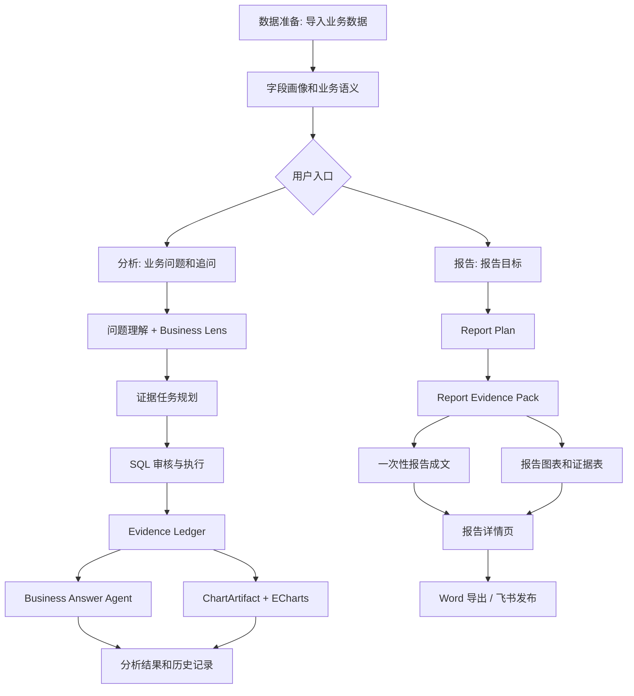

# InsightFlow Agent

InsightFlow Agent 是一个中文优先的业务数据分析智能体产品原型。用户可导入 CSV、Excel 或 SQLite 数据，用自然语言提问，获得有证据支持的业务分析、交互图表和经营报告；报告也可导出为 Word，或在本机已配置 `lark-cli` 时发布到飞书文档。

## 核心能力

- **数据准备**：导入 CSV、Excel 工作簿或 SQLite，生成数据画像、字段识别和业务语义层草稿。
- **业务分析**：支持中文提问、追问和历史恢复；通过多证据任务、SQL 审核、只读查询和证据账本生成结论。
- **报告交付**：独立的报告中心可生成中文经营报告、图表和证据表，并提供 Word 导出与飞书发布。
- **图表展示**：使用统一 `ChartArtifact` 合同，前端以 ECharts 交互展示，同时保留静态图片 fallback。
- **安全边界**：SQL 只读审核、证据校验、敏感信息过滤和本地生成物忽略，避免把未经验证的内容当作业务事实。

## 工程化能力

- **可复现部署**：Docker Compose 一键构建和启动前后端；容器以非 root 用户运行，具备健康检查、持久化 Volume 与无密钥 Smoke 验收。
- **可观测性**：提供安全的 Request ID、结构化日志和 Prometheus 指标，可观察接口、分析流程、LLM、SQL、证据校验、报告和发布状态。
- **定位与运维**：可选 Prometheus/Grafana 监控 Profile 提供系统健康、工作流、工具与交付面板；告警与 Runbook 用于安全定位和恢复问题。
- **失败隔离**：日志、指标和 Trace 等观测能力异常时，不会阻断正常业务分析链路。

## 产品流程



## 技术栈

- **Backend**：FastAPI、Pydantic、pandas、sqlglot、sqlparse
- **Frontend**：Next.js、React、TypeScript、ECharts、Vitest
- **LLM**：DeepSeek OpenAI-compatible API
- **数据与交付**：SQLite、CSV、Excel、Word export、Feishu `lark-cli`
- **部署与监控**：Docker Compose、Prometheus、Grafana
- **测试**：pytest、Vitest、Docker Smoke、Prometheus rule tests

## 快速开始

### 本地开发

前置条件：Python 3.12、Node.js 22。

```bash
cp .env.example .env

python3 -m venv .venv
source .venv/bin/activate
pip install -r requirements-dev.txt

python3 -m uvicorn api.app:app --reload --host 127.0.0.1 --port 8000
```

另开一个终端启动前端：

```bash
cd frontend
npm install
npm run dev
```

打开 <http://127.0.0.1:3000>。默认情况下，前端请求 `http://localhost:8000`；如需更改后端地址，可在本地 `.env` 中设置 `NEXT_PUBLIC_API_BASE`。

### Docker Compose

前置条件：Docker Desktop，或 Linux Docker Engine + Docker Compose v2。基础服务不需要 DeepSeek Key 或飞书凭证：

```bash
make build
make up
make ps
```

访问前端 <http://127.0.0.1:3000>，后端为 <http://127.0.0.1:8000>。日常停止使用：

```bash
make down
```

该命令会停止容器并保留数据 Volume。基础 Compose 仅启动 backend 和 frontend，端口默认只绑定本机回环地址。

### 可选监控

如需查看监控面板，先在已忽略提交的本地 `.env` 中设置非空 Grafana 密码：

```env
GRAFANA_ADMIN_PASSWORD=请设置一个本地密码
```

然后启动监控 Profile：

```bash
make observability-up
make observability-ps
```

Prometheus：<http://127.0.0.1:9090>

Grafana：<http://127.0.0.1:3001>

停止监控服务但保留数据：

```bash
make observability-down
```

完整的监控、告警和安全排障方式见 [可观测性 Runbook](docs/operations/observability-alerts.md)。

## 健康检查与监控接口

| 接口 | 用途 |
|---|---|
| `GET /health/live` | 确认 API 进程是否可响应 |
| `GET /health/ready` | 确认 Workspace、Report、Trace 存储与基础配置是否就绪 |
| `GET /metrics` | 提供 Prometheus 指标，默认不应直接暴露公网 |

`X-Request-ID` 会安全关联一次 HTTP 请求、分析流程和受控日志事件；它不会作为 Prometheus 指标标签使用。结构化日志、指标和 Dashboard 不记录 Prompt、SQL、原始业务数据、Token、Provider payload 或本机路径。

## 常用验证命令

```bash
# 后端测试
python3 -m pytest -q

# 前端测试与生产构建
npm --prefix frontend test
npm --prefix frontend run build

# 无密钥 Docker 验收
make smoke

# 监控配置、告警规则和 Dashboard 合同检查
make observability-check

# P38 安全故障注入、脱敏与指标基数验收
make observability-acceptance
```

`make observability-acceptance` 不调用真实 DeepSeek，不登录或发布飞书，也不会删除业务数据 Volume。

## 主要目录

```text
api/                     FastAPI 产品接口
agents/                  分析、回答、报告、图表相关 agent
frontend/                Next.js 产品前端
llm_ops/                 DeepSeek provider 和运行时开关
observability/           日志、指标、Prometheus、Grafana 与告警配置
semantic_layer/          数据画像、字段语义和业务别名
sql_planning/            SQL 规划、审核和安全边界
workspaces/              工作区、分析运行、报告、导出、飞书发布
docs/deployment.md       Docker 部署、数据卷和排障说明
docs/operations/         监控告警与安全 Runbook
docs/product/plans/      阶段计划和历史记录
tests/                   后端 pytest 测试
```

## 关键 API

```text
POST /api/workspaces
POST /api/workspaces/{workspace_id}/sources/upload
POST /api/workspaces/{workspace_id}/sources/sqlite
POST /api/workspaces/{workspace_id}/profile
POST /api/workspaces/{workspace_id}/semantic-layer/draft

POST /api/workspaces/{workspace_id}/runs
GET  /api/workspaces/{workspace_id}/runs
GET  /api/workspaces/{workspace_id}/runs/{run_id}
POST /api/workspaces/{workspace_id}/runs/{run_id}/follow-ups

POST /api/workspaces/{workspace_id}/reports
GET  /api/workspaces/{workspace_id}/reports
GET  /api/workspaces/{workspace_id}/reports/{report_id}
GET  /api/workspaces/{workspace_id}/reports/{report_id}/download
POST /api/workspaces/{workspace_id}/reports/{report_id}/export
POST /api/workspaces/{workspace_id}/reports/{report_id}/publish/feishu
```

## 配置与安全

- 复制 [`.env.example`](.env.example) 为本地 `.env`；真实密钥只放在本地忽略文件或部署 Secret 中。
- 不要把 DeepSeek、飞书或其他密钥写入 `NEXT_PUBLIC_*`、Docker build args、镜像或版本库。
- 未配置 DeepSeek Key 时，项目仍可启动并走本地 fallback；真实业务回答和报告质量不代表最终体验。
- 基础 Compose 不安装 `lark-cli`，因此容器内飞书发布会安全失败或给出警告；本机非容器模式可使用已登录的 CLI。

## 当前限制

- 当前优先面向中文业务数据分析场景。
- Compose 当前为单后端实例配合本地 SQLite/Workspace 文件，不支持多副本、Kubernetes、云部署、TLS、正式 Secret Manager 或灾备。
- 尚未实现真实 SaaS 鉴权、RBAC、多租户隔离、Alertmanager、OpenTelemetry/OTLP、外部 Observability SaaS 或前端遥测。

## 文档

| 文档 | 内容 |
|---|---|
| [部署手册](docs/deployment.md) | Docker、环境变量、数据卷、健康检查与排障 |
| [监控与告警 Runbook](docs/operations/observability-alerts.md) | Dashboard、告警、诊断、恢复和安全操作边界 |
| [开发计划](DEVELOPMENT_PLAN.md) | 当前阶段与后续规划 |
| [开发状态](DEVELOPMENT_STATUS.md) | 已完成能力与验证记录 |
| [P37 部署计划](docs/product/plans/2026-07-11-p37-containerized-reproducible-deployment.md) | 容器化部署的详细实现和验收 |
| [P38 可观测性计划](docs/product/plans/2026-07-11-p38-observability-and-operations.md) | 可观测性与运维的详细实现和验收 |

## 提交前检查

不要提交本地密钥、运行数据、Trace、报告、前端构建产物或缓存。提交前建议运行：

```bash
git status --short
git diff --check
```
