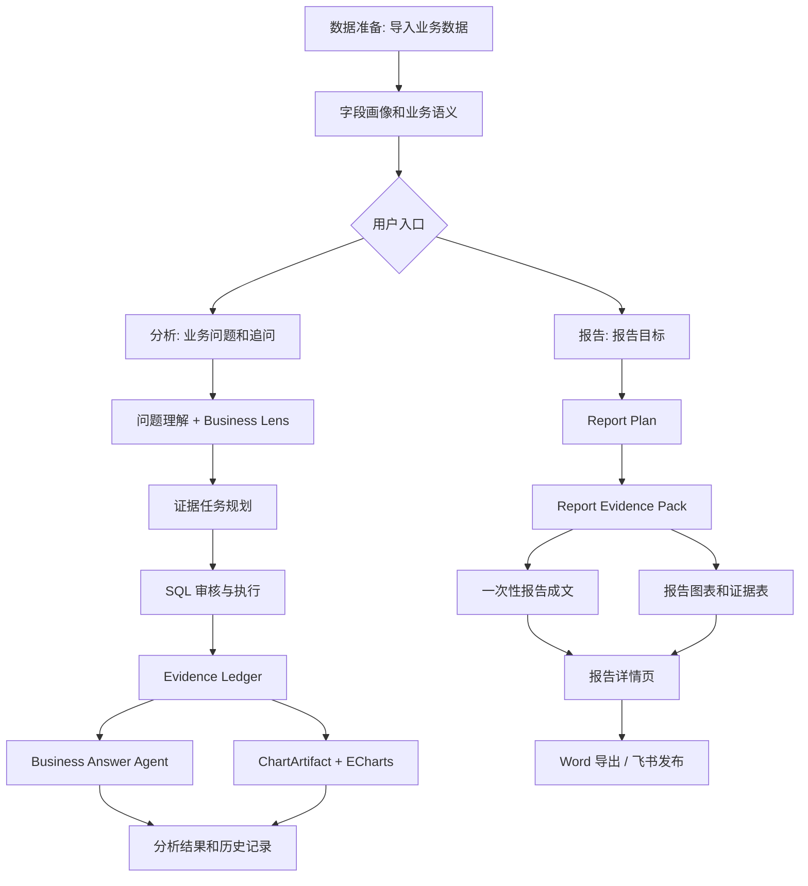

# InsightFlow Agent

InsightFlow Agent 是一个中文优先的业务数据分析智能体产品原型。用户可以导入 CSV、Excel 或 SQLite 数据，用自然语言提出业务问题，生成证据驱动的分析结论、交互图表、经营报告，并把报告导出为 Word 或发布到飞书文档。

项目重点展示三类能力：

- **Multi-agent workflow**: 问题理解、业务口径落地、证据规划、SQL 审核与执行、证据账本、业务回答、图表生成、报告成文、外部发布分工协作。
- **Tool calling**: SQLite 查询、SQL 安全审核、ECharts 图表生成、Word 文档导出、飞书文档发布。
- **Evidence-backed business output**: 大模型负责解释和表达，事实层由工具查数、计算、校验和引用证据，减少“看起来合理但没有数据支撑”的回复。

## 当前能力

- **数据源管理**: 支持上传 CSV、Excel 工作簿，或导入 SQLite 数据库。
- **数据理解**: 自动生成数据画像、字段识别、中文业务别名和语义层草稿。
- **分析工作台**: 支持中文业务提问、追问、历史分析恢复、多证据任务、证据账本、业务结论和图表展示。
- **报告中心**: 根据用户输入的报告目标生成完整中文业务报告，不复用分析工作台的问答拼接路径。
- **图表系统**: 统一 `ChartArtifact` 合同，前端使用 ECharts 交互展示，并保留静态图片 fallback。
- **真实导出**: 支持下载 Word 报告，也可以通过 `lark-cli` 发布到飞书文档，包含正文、证据表和图表图片。
- **安全边界**: SQL 审核、只读查询、证据校验、artifact hygiene、敏感信息过滤和本地生成物忽略。
- **统一产品界面**: 采用“数据准备 / 分析 / 报告”三入口决策工作台；设置保持次级，分析结果按结论、图表、证据优先展示，并保留历史、追问、技术详情和报告交付能力。

## 产品路径



## 技术栈

- **Backend**: FastAPI, Pydantic, pandas, SQLAlchemy, sqlglot, sqlparse
- **Frontend**: Next.js, React, TypeScript, ECharts, Vitest
- **LLM**: DeepSeek OpenAI-compatible API
- **Data / Tools**: SQLite, CSV, Excel, Word export, Feishu `lark-cli`
- **Tests**: pytest, Vitest

## 快速开始

### 1. 安装后端依赖

```bash
python3 -m venv .venv
source .venv/bin/activate
pip install -r requirements.txt
```

### 2. 配置环境变量

复制 `.env.example` 到 `.env`，至少按需配置 DeepSeek：

```bash
cp .env.example .env
```

真实大模型模式建议配置：

```env
DEEPSEEK_API_KEY=your_deepseek_api_key
DEEPSEEK_BASE_URL=https://api.deepseek.com
DEEPSEEK_MODEL=deepseek-v4-pro
INSIGHTFLOW_PRODUCT_LIVE_MODE=1
```

飞书发布需要本机已安装并登录 `lark-cli`，然后配置：

```env
LARK_CLI_BIN=/absolute/path/to/lark-cli
```

如果不配置 DeepSeek key，项目仍可启动前后端并运行部分本地路径，但真实业务回答和真实报告成文会退回到本地 fallback，效果不代表最终产品体验。

### 3. 启动后端

```bash
python3 -m uvicorn api.app:app --reload --host 127.0.0.1 --port 8000
```

### 4. 启动前端

```bash
cd frontend
npm install
npm run dev
```

打开 [http://127.0.0.1:3000](http://127.0.0.1:3000)。

前端默认请求 `http://localhost:8000`。如果后端地址不同，可以在前端环境中设置：

```env
NEXT_PUBLIC_API_BASE=http://127.0.0.1:8000
```

## 使用示例

可以先上传 `sample_data/chinese_business/` 下的中文业务数据，然后尝试：

- `最近90天哪个渠道收入最高？为什么？`
- `各渠道投放花费和收入表现怎么样？帮我生成图表。`
- `最近90天销售额最高的客户分群是谁？有什么建议？`
- `客服反馈里投诉最多的问题是什么？`
- `生成一份最近90天经营复盘报告，重点看收入结构、趋势变化、渠道表现和客服问题。`
- 在报告详情页点击 `导出 Word` 或 `发布到飞书`。

## 主要目录

```text
api/                     FastAPI 产品接口
agents/                  分析、回答、报告、图表相关 agent
frontend/                Next.js 产品前端
llm_ops/                 DeepSeek provider 和运行时开关
question_understanding/  问题理解、追问和业务意图结构
semantic_layer/          数据画像、字段语义和业务别名
sql_planning/            SQL 规划、审核和安全边界
visualization/           ChartArtifact、ECharts option、静态图表 fallback
workspaces/              工作区、分析运行、报告、导出、飞书发布
sample_data/             可用于本地演示的示例数据
tests/                   后端 pytest 测试
frontend/tests/          前端 Vitest 测试
docs/product/plans/      P 阶段开发计划和历史记录
```

## 关键 API

```text
POST /api/workspaces
POST /api/workspaces/{workspace_id}/sources/upload
POST /api/workspaces/{workspace_id}/sources/sqlite
POST /api/workspaces/{workspace_id}/profile
POST /api/workspaces/{workspace_id}/semantic-layer/draft

POST /api/workspaces/{workspace_id}/runs
GET  /api/workspaces/{workspace_id}/runs
GET  /api/workspaces/{workspace_id}/runs/{run_id}
POST /api/workspaces/{workspace_id}/runs/{run_id}/follow-ups

POST /api/workspaces/{workspace_id}/reports
GET  /api/workspaces/{workspace_id}/reports
GET  /api/workspaces/{workspace_id}/reports/{report_id}
GET  /api/workspaces/{workspace_id}/reports/{report_id}/download
POST /api/workspaces/{workspace_id}/reports/{report_id}/export
POST /api/workspaces/{workspace_id}/reports/{report_id}/publish/feishu
```

## 测试

完整后端测试：

```bash
python3 -m pytest
```

前端测试和构建：

```bash
cd frontend
npm test
npm run build
```

常用重点回归：

```bash
python3 -m pytest \
  tests/test_workspace_analysis_runner.py \
  tests/test_workspace_report_api.py \
  tests/test_feishu_publisher.py \
  tests/test_export_package.py -q
```

真实 DeepSeek 验收默认不会在普通测试中运行。需要手动开启：

```bash
INSIGHTFLOW_LIVE_DEEPSEEK_TESTS=1 INSIGHTFLOW_PRODUCT_LIVE_MODE=1 python3 -m pytest tests/test_live_deepseek_product_acceptance.py -q
```

## 生成物和提交规范

不要提交本地生成物、密钥或运行结果。常见生成物包括：

```text
.env
data/*.db
workspaces/*
logs/traces/*
reports/charts/*
reports/markdown/*
tmp/*
frontend/.next/
frontend/node_modules/
```

提交前建议运行：

```bash
git status --short
git diff --check
```

## 当前边界

- 当前产品优先面向中文业务数据分析场景。
- 真实 SaaS 鉴权、RBAC、多租户隔离、CI/CD、Docker 部署暂未作为当前重点。
- 飞书发布依赖本机 `lark-cli` 登录状态；图表会以静态图片形式插入飞书文档。
- 大模型不会直接执行 SQL 或写外部系统；执行、校验和发布都走受控工具边界。

## 开发记录

详细阶段计划和历史记录保留在：

- `DEVELOPMENT_PLAN.md`
- `DEVELOPMENT_STATUS.md`
- `docs/product/plans/`

当前主线已经完成到 P36: Feishu document publishing；2026-07-10 完成了前端界面整合，产品主导航收敛为数据准备、分析、报告，同时保持 Analysis Workbench 与 Report Center 的功能和产物边界。下一步重点可以继续增强外部平台发布、图表/表格导出体验、真实业务数据兼容性和部署形态。
